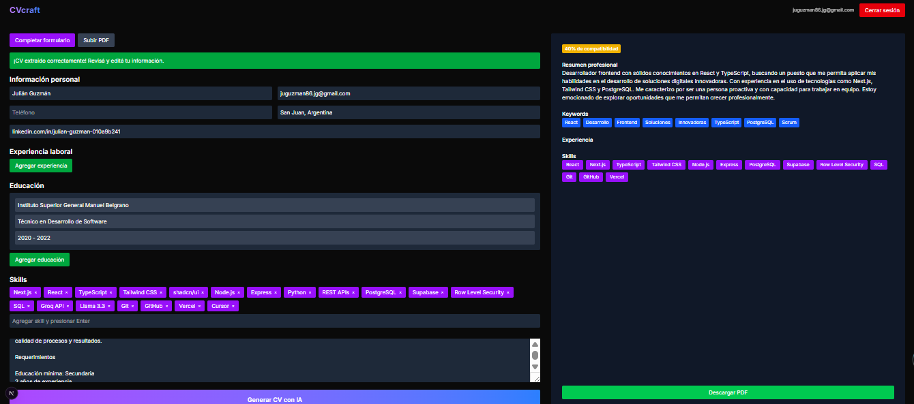
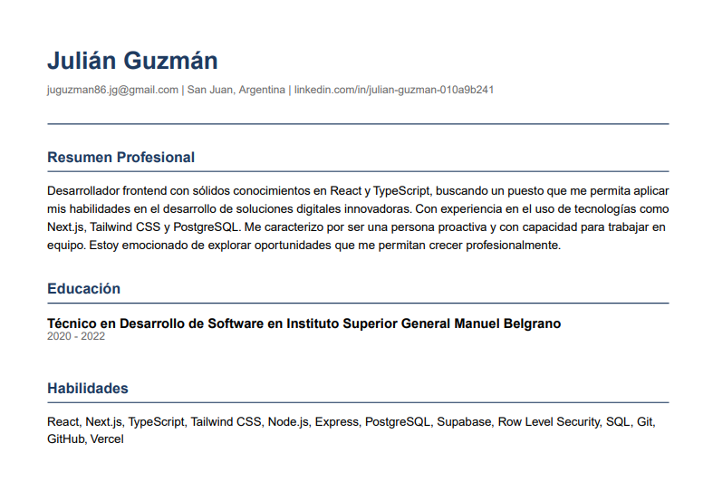

# CVcraft — Generador de CVs con IA

## 🚀 Demo

[Live Demo](https://cvcraft-seven.vercel.app)

## 📌 Descripción

CVcraft es una aplicación que utiliza inteligencia artificial para generar y optimizar tu currículum vitae en base a una oferta laboral. Te ayuda a ahorrar tiempo y a presentar un CV más competitivo, adaptado al puesto al que quieras postular.

## ✨ Features

- Autenticación con Google OAuth (Supabase)
- Carga de CV existente en PDF con extracción automática de datos por IA
- Formulario manual para completar información del CV
- Adaptación del CV a una oferta laboral específica usando IA
- Cálculo de match score entre el CV y la oferta
- Vista previa en pantalla del CV generado
- Descarga del CV optimizado en PDF

## 🛠️ Tech Stack

- Next.js 14 (App Router)
- TypeScript
- Tailwind CSS
- Supabase (Auth)
- Groq API (Llama 3.3 70b)
- unpdf (extracción de texto de PDFs)
- @react-pdf/renderer (generación de PDFs)
- shadcn/ui

## ⚙️ Correr localmente

1. Cloná el repositorio:

```bash
git clone https://github.com/JulianGuzmanDev/cvcraft.git
cd cvcraft
```

2. Instalá dependencias:

```bash
npm install
```

3. Configurá las variables de entorno (ver sección siguiente).
4. Ejecutá el servidor en modo desarrollo:

```bash
npm run dev
```

5. Abrí http://localhost:3000 en el navegador y logueate con Google.

## 🗄️ Variables de entorno

| Variable                        | Descripción                                 |
| ------------------------------- | ------------------------------------------- |
| `NEXT_PUBLIC_SUPABASE_URL`      | URL de tu proyecto Supabase                 |
| `NEXT_PUBLIC_SUPABASE_ANON_KEY` | Clave anónima de Supabase                   |
| `GROQ_API_KEY`                  | API key para el modelo Groq (Llama 3.3 70b) |

## 📐 Decisiones técnicas

- **Groq vs OpenAI:** usamos Groq porque ofrece tier gratuito, buena velocidad y se integra fácil con el flujo de Groq Chat.
- **Sin almacenamiento de CVs:** para maximizar la privacidad y simplificar la arquitectura, todos los CV se generan y sirven en memoria; no se guardan en la base de datos.
- **unpdf en server-side:** elegimos unpdf para parsear PDFs del lado del servidor ya que permite extraer texto sin necesidad de dependencias complicadas y funciona bien con los formatos de CV comunes.

  ## 📸 Screenshots




## 🔮 Próximas features

- Múltiples templates de diseño para el PDF
- Historial de CVs generados
- Sugerencias de mejora del CV

## ⚠️ Limitaciones conocidas

- El nombre del usuario puede no extraerse correctamente de PDFs con formato especial
